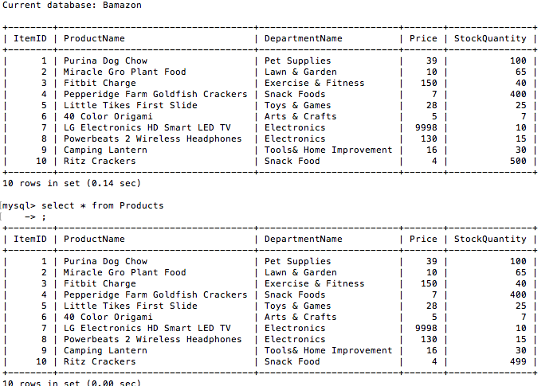

Amazon-like storefront using MySQL, the MySQL NPM Package, and the Prompt Package

Using MySQL, a database of products was created. A user can enter the ID number of the product and how many they want to buy. They will then be told if there is a sufficient quantity left of that item. If there is not, they will be told their is insufficient quantity. If there enough of that item, the user will be told the total price of their purchase and the database will be updated as seen below where ItemID = 10.

